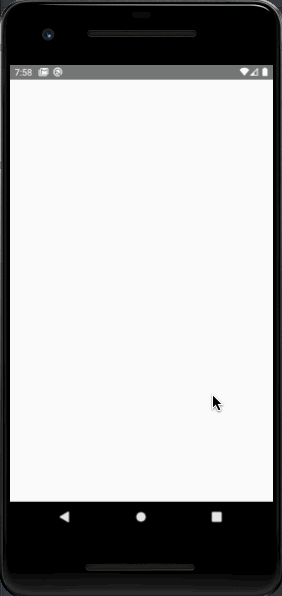

<div align="center">
  
</div>  

## :computer: Projeto

PLIM - é uma plataforma baseada em Economia Circular que facilita a contratação de microcrédito ao micro e pequeno empreendedor.

## :pushpin: Tecnologias

Esse projeto foi desenvolvido com as seguintes tecnologias:

- [React Native](https://reactnative.dev/)
- [TypeScript](https://www.typescriptlang.org/)
- [Axios](https://github.com/axios/axios)
- [Styled Components](https://styled-components.com/)


## :point_down: Executando o projeto

No seu terminal copie e cole ou digite o comando abaixo:

```git
git clone https://github.com/jhonatasmatos/plim.git
````

Após realizar o clone acesse a pasta do projeto:

```git
cd plim
````

Logo em seguida digite o comando __*yarn*__ para baixar e atualizar as dependências do projeto

Caso queria rodar no iOS acesse:

```terminal
cd ios
````

E execute o comando __*pod install*__ .

Para executar o projeto digite em seu terminal o comando:

Para Adroid
```terminal
yarn android
````

Para iOS
```terminal
yarn ios
````

Após isso, você já esta pronto para navegar e conhecer o app !!!

---
Feito com coração, café e muito esforço :heart: :rocket: